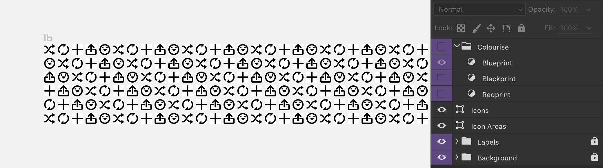

# Greyprint help

- [Templates](https://github.com/bjango/Greyprint/blob/master/Help/Help.md#templates)
- [Styles](https://github.com/bjango/Greyprint/blob/master/Help/Help.md#styles)
- [Gradient maps](https://github.com/bjango/Greyprint/blob/master/Help/Help.md#gradient-maps)
- [Illustrator actions](https://github.com/bjango/Greyprint/blob/master/Help/Help.md#illustrator-actions)
- [Version history](https://github.com/bjango/Greyprint/blob/master/Help/Version%20History.md)
- [License](https://github.com/bjango/Greyprint/blob/master/Help/License.md)
- [Feedback and future plans](https://github.com/bjango/Greyprint/blob/master/Help/Help.md#feedback-and-future-plans)

### Templates

The Greyprint templates contain many 16×16, 24×24, 32×32, and 48×48 pixel single-origin organic, artisanally crafted pure white icon zones. These icon zones can be filled with your hopes and dreams. They can be filled with your wildest desires.

Just kidding, they’re just normal white boxes. Lots and lots of white boxes. The same white boxes you could draw yourself in a few minutes. But, the point is, now you don’t have to. Now can you just fire up the Greyprint templates and be working in seconds.

### Styles

The Greyprint templates also include 12 pre-made styles, that can be used to rapidly construct icons, symbols and glyphs without needing to edit the fill or stroke every time a new shape is created.

The 10%, 20%, 30% and 40% opacity styles can be used to construct guide shapes, or make positioning of other objects apparent. The black fill, white fill and stroke styles cover many commonly used styles, avoiding slow manual editing.

Here is an example using a Greyprint template and styles to draw a shuffle icon in Illustrator.

Where possible, separate style files have also been saved: `Greyprint Styles.asl` for Photoshop, `Greyprint Styles.ait` for Illustrator, and `Greyprint Styles.afstyles` for Affinity Designer.

Pre-made styles are available for Photoshop, Illustrator, Sketch, and Affinity Designer.

### Gradient maps

For design tools that have gradient maps (Photoshop and Affinity Designer), a `Colourise` group is included in the templates. Turning it on will apply one of the enclosed gradient maps. 

Not only do they look ace, they also invert everything — black icons on white become white icons on varying coloured backgrounds. This means it’s possible to use the Greyprint styles to create black icons, but preview them as you edit as white icons on a coloured background.

### Illustrator actions

As an added bonus, the `Illustrator` folder includes some actions. These actions add single click shortcuts from some frequent actions I use. Maybe they’ll help you, too.

**Add Anchor Points** and **Outline Stroke**: A quicker way to access the items under the `Object › Path` menu.

**Nudge**: Eight nudge actions for 0.5px and 4px in all four directions. Quicker than editing your preferences or using the move window and typing in the distance needed.

**Flip Horizontally** and **Flip Vertically**: As you’d expect, these flip the currently selected objects.

**Scale by 50%, 200%, 300%, and 400%**: As you’d expect, these scale the currently selected objects by the denoted amount. Faster than double clicking the scale tool.

To install the actions, choose `Load Actions` from the flyout menu in the Actions panel, and choose `Greyprint Actions.aia`. 

**Select Same Fill Color** and **Select Same Stroke Color**: A quicker way to access the items under the `Select › Same` menu.

-----

### Feedback and future plans

These documents are maintained by [@marcedwards](https://twitter.com/marcedwards). If you find errors or have suggestions, I’d love to hear about them.