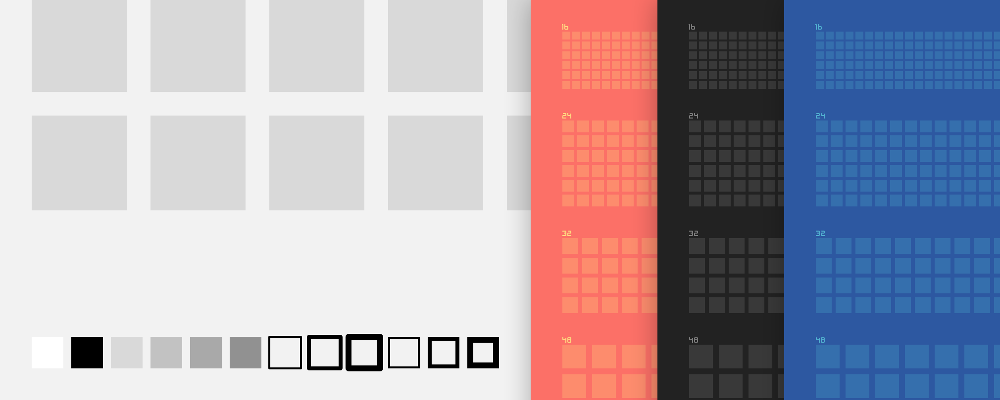
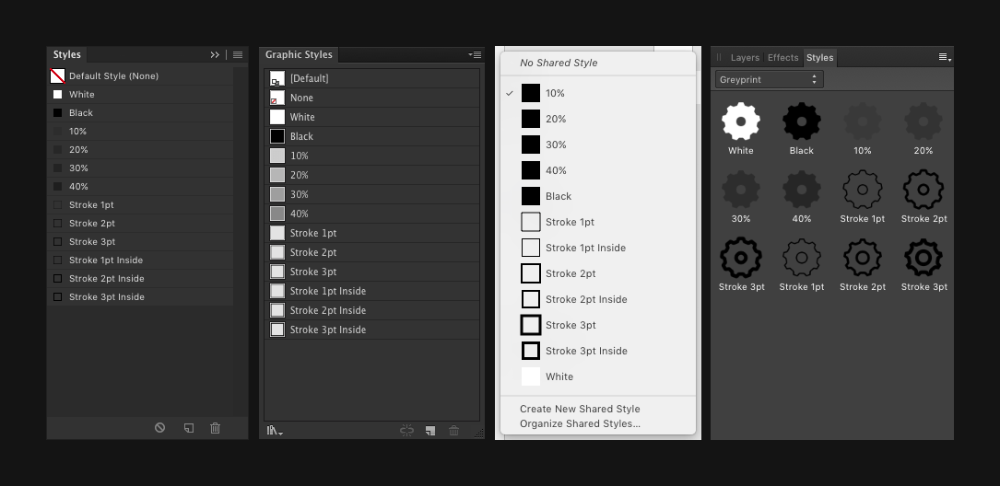
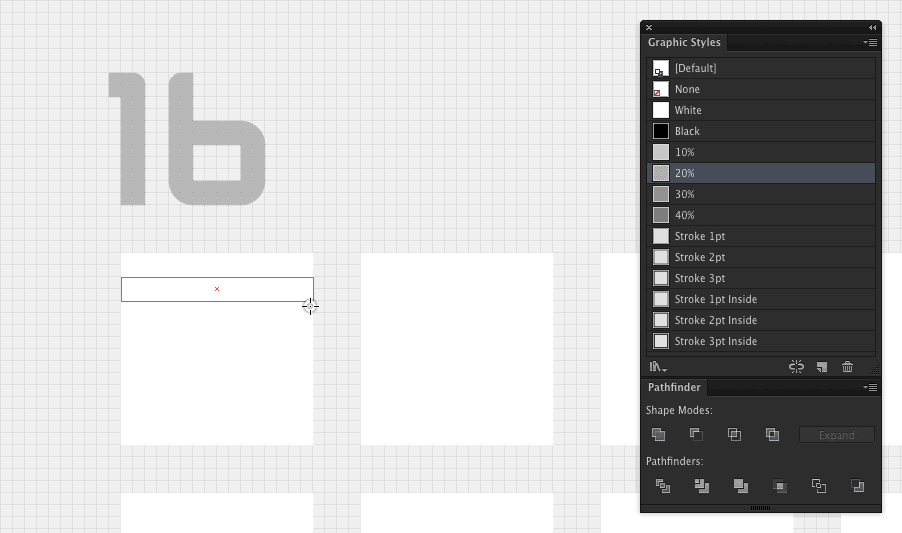

# Greyprint

[Greyprint](https://bjango.com/designresources/) is a set of templates with pre-made styles to assist icon, symbol, and glyph design. The templates are built for Photoshop, Illustrator, Sketch, and Affinity Designer. All free and open source, released under the [BSD license](https://github.com/bjango/Greyprint/blob/master/Help/License.md).

**Download:** **[Greyprint](https://github.com/bjango/Greyprint/archive/master.zip)** — 1.1 ([version history](https://github.com/bjango/Greyprint/blob/master/Help/Version%20History.md))

-----

Pre-made styles are available for Photoshop, Illustrator, Sketch, and Affinity Designer.



### Help

- [Templates](https://github.com/bjango/Greyprint/blob/master/Help/Help.md#templates)
- [Styles](https://github.com/bjango/Greyprint/blob/master/Help/Help.md#styles)
- [Gradient maps](https://github.com/bjango/Greyprint/blob/master/Help/Help.md#gradient-maps)
- [Version history](https://github.com/bjango/Greyprint/blob/master/Help/Version%20History.md)
- [License](https://github.com/bjango/Greyprint/blob/master/Help/License.md)
- [Feedback and future plans](https://github.com/bjango/Greyprint/blob/master/Help/Help.md#feedback-and-future-plans)

-----

Here is an example using a Greyprint template and styles to draw a shuffle icon in Illustrator.



The 10%, 20%, 30% and 40% opacity styles can be used to constuct guide shapes, or make positioning of other objects apperent. The black fill, white fill and stroke styles cover many commonly used styles, avoiding slow manual editing.

Greyprint exists to give you a bunch of white boxes to fill with your amazing icons, and the styles needed to build those icons quickly.

-----

Short questions can be sent to [@marcedwards](https://twitter.com/marcedwards) or [@bjango](https://twitter.com/bjango) on Twitter. More verbose questions can be sent via the [Bjango contact page](https://bjango.com/contact/). If you notice any errors, please let me know.

-----

```
        :::::::::   :::::::     ::::      ::::    :::   ::::::::    :::::::: 
       :+:    :+:      :+:    :+: :+:    :+:+:   :+:  :+:    :+:  :+:    :+: 
      +:+    +:+      +:+   +:+   +:+   :+:+:+  +:+  +:+         +:+    +:+  
     +#++:++#+       +#+  +#++:++#++:  +#+ +:+ +#+  :#:         +#+    +:+   
    +#+    +#+      +#+  +#+     +#+  +#+  +#+#+#  +#+   +#+#  +#+    +#+    
   #+#    #+#  #+# #+#  #+#     #+#  #+#   #+#+#  #+#    #+#  #+#    #+#     
  #########    #####   ###     ###  ###    ####   ########    ########       
```
